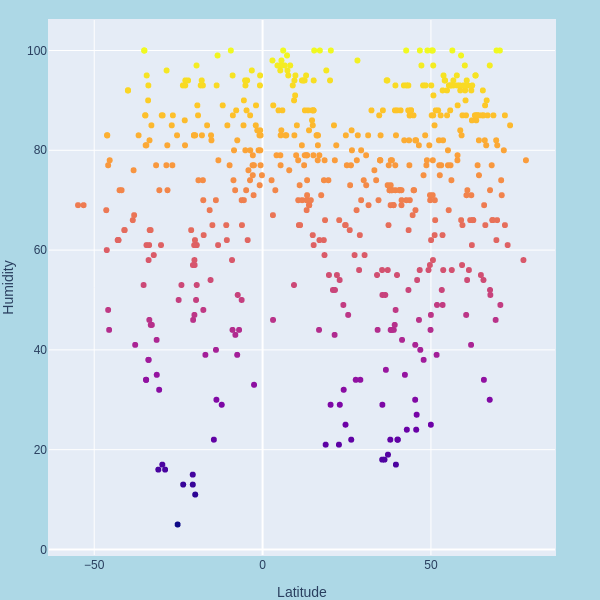
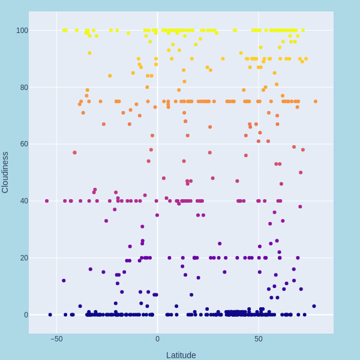
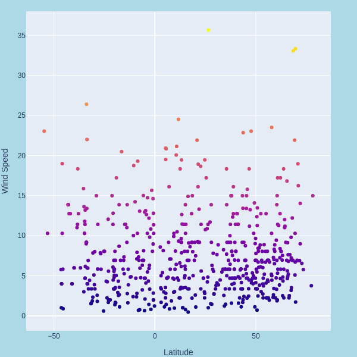

# Python_api_homework
# WeatherPy

I was tasked with creating a Python script to visualize the weather of 500+ cities across the world of varying distance from the equator. To accomplish this, I had to utilizing a simple Python library cities , the OpenWeatherMap API, and Plotly.

# My objective is to build a series of scatter plots to showcase the following relationships:

Temperature (F) vs. Latitude

Humidity (%) vs. Latitude

Cloudiness (%) vs. Latitude

Wind Speed (mph) vs. Latitude

I had to complete the  analysis using a Jupyter notebook, Matplotlib, pandas and Plotly.

using plotlys .. **plotly.offline.plot(fig, filename='name.html')**.. will expot the graph along in to a HTML file that can be viewed offline .. I on my webpage used 

<h1 class="intro">Humidity </h1>
    
<iframe src="../Graphs/Humidity.html" id="graph" name="targetframe" allowTransparency="true" scrolling="no" frameborder="2" height="650" width="650">
 </iframe>

this alowed me to stay with in python export to html and then enbend my graph in to my webpage wile useing very little time in HTML/CSS or any javascrip click link to see page 
https://jurioste4.github.io/weather/pages/humidity.html

I then  written description of three observable trends based on the data and proper labeling of your plots, 

