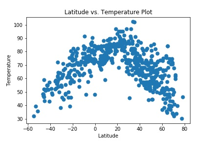
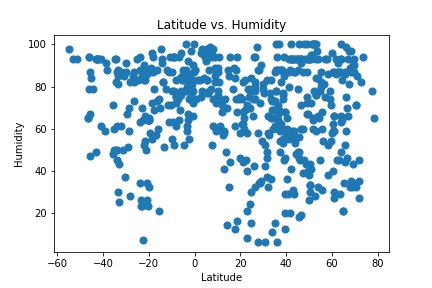
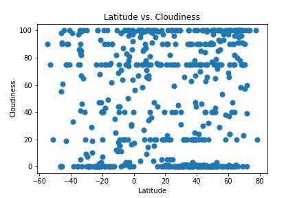
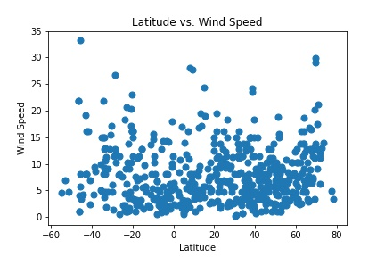

# WeatherPy

I was tasked with creating a Python script to visualize the weather of 500+ cities across the world of varying distance from the equator. To accomplish this, I had to utilizing a simple Python library, the OpenWeatherMap API, and a little common sense to create a representative model of weather across world cities.

# My objective is to build a series of scatter plots to showcase the following relationships:

###  Latitude vs. Temperature (F)

### Latitude vs. Humidity (%)

###   Latitude vs Cloudiness (%)

###  Latitude vs.  Wind Speed (mph) 

# My final notebook had:

Randomly select at least 500 unique (non-repeat) cities based on latitude and longitude.
Perform a weather check on each of the cities using a series of successive API calls.
Include a print log of each city as it's being processed with the city number and city name.
Save both a CSV of all data retrieved and png images for each scatter plot.

# As final considerations:

I had to complete the  analysis using a Jupyter notebook, Matplotlib or Pandas plotting libraries.
I then  written description of three observable trends based on the data and proper labeling of your plots, including aspects like: Plot Titles (with date of analysis) and Axes Labels.

